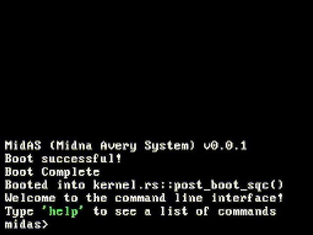

  <h1>Welcome to MidAS!</h1>
    
MidAS is a hobby operating system written in <a href="https://www.rust-lang.org/">Rust</a>

    

      
      
      
      

      
      
      
    

    

  <h1>How to run</h1>
  <h2> Requirements:</h2>
  Install Rust Nightly (Install with <code>rustup default nightly</code>) 
  qemu for 64-bit systems (Downloads at <a href="https://qemu.org/download">qemu.org</a>) 

  <h2>Building / Running</h2>
  <ul>
    <li>Make sure <i>qemu</i> is added to your <i>path</i></li>
    <li>Make sure <i>rust</i> is installed (run <code>rustc --version</code>)</li>
    <li>Add <i>llvm-tools-preview</i> with <code>rustup component add llvm-tools-preview</code></li>
    <li><code>cargo run</code></li>
  </ul>
  
  
If anything goes wrong, feel free to create an <a href="https://github.com/MindlessSea/MidAS/issues/new">issue</a>!

  <h1>Resources</h1>
  <ul>
    <li><a href="https://os.phil-opp.com">Get Started with OSDev in Rust</a></li>
    <li><a href="https://wiki.osdev.org/Main_Page">OSDev Wiki (C/C++ & Rust)</a></li>
  </ul>

